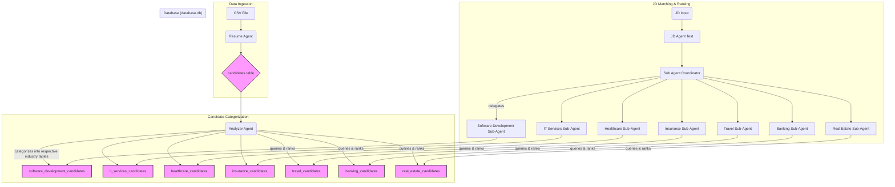

# JD Agent

## Overview

The JD Agent is a comprehensive AI-powered recruitment analysis system designed to automate and enhance the process of candidate management and job description (JD) matching. It operates through a pipeline of specialized agents: a Resume Agent for initial candidate data intake, an Analyzer Agent for categorization, and a JD Agent Test for user-facing JD analysis and candidate ranking. This modular approach ensures efficient processing, categorization, and intelligent matching to streamline recruitment workflows.

## Demo

Demo: <https://youtu.be/DtXx7eVkpfw>

## Agent Details

| Attribute        | Detail                                                  |
|------------------|---------------------------------------------------------|
| Interaction Type | Conversational (for JD Agent Test) / Batch Processing   |
| Complexity       | High                                                    |
| Agent Type       | Multi-Agent System (Orchestrated Pipeline)              |
| Vertical         | Recruitment / HR Technology / Talent Acquisition        |
| Components       | Resume Agent, Analyzer Agent, JD Agent Test  (with Sub-Agents and Coordinator), SQLite Database            | 


## Agent Architecture

The JD Agent operates as a sophisticated multi-agent pipeline:

- **Resume Agent**: Ingests candidate resumes from CSV files and populates a central candidates table in the SQLite database.db.

- **Analyzer Agent**: Reads from the candidates table, categorizes each candidate into one of seven predefined industry verticals (Software Development, IT Services, Healthcare, Insurance, Travel, Banking, Real Estate), and stores them in respective category-specific tables (e.g., software_development_candidates, healthcare_candidates) within the same database.db.

- **JD Agent Test**: The primary user-facing agent for job description analysis and candidate ranking. It uses a hierarchical sub-agent architecture:

- **Sub Agent Coordinator**: Analyzes the input Job Description to determine its primary industry category.

- **Category-Specific Sub-Agents**: Based on the coordinator's assessment, the JD is passed to the relevant sub-agent (e.g., Software_Developer_Agent, Banking_Agent). Each sub-agent is specialized to query its corresponding candidate table (e.g., software_development_candidates) and rank candidates based on the provided JD.




## Tools and APIs Used

The system leverages a combination of custom tools and large language models:

| Agent / Components            | Description                                                                                  | Tools used                              |
|-------------------------------|----------------------------------------------------------------------------------------------|-----------------------------------------|
| Resume Agent                  | Ingests candidate data from CSVs and populates the candidates table.                         | mcp tools (for SQLite DB operations)    |
| Analyzer Agent                | Reads from the candidates table, categorizes candidates into industry-specific tables.       | query_table, classify_and_analyse       |
| JD Agent Test (Main)          | User-facing agent for JD analysis and orchestrating sub-agent operations.                    | -                                       |
| Sub Agent Coordinator         | Determines the category of an input JD and delegates to the appropriate sub-agent.           | Internal logic/LLM reasoning            |
| Category-Specific Sub-Agents  | Queries their respective candidate tables, ranks candidates based on JD, and prints results. | query_table (to access category tables) |
| Database (database.db)        | Central SQLite database storing all candidate data in various tables.                        | -                                       |

All LLM-based reasoning across the agents and sub-agents is powered by the gemini-2.0-flash model.

## Key Features

- **Automated Candidate Ingestion**: Efficiently load candidate resumes from CSV files into a structured database.

- **Intelligent Candidate Categorization**: Automatically classify candidates into 7 industry-specific categories, enabling targeted search.

- **Dynamic JD Analysis**: The JD Agent Test can understand the context of a job description and direct it to the most relevant sub-agent.

- **Category-Specific Candidate Ranking**: Sub-agents leverage their domain knowledge and access to categorized candidate pools to rank individuals against specific job requirements.

- **Streamlined Recruitment**: Provides a powerful tool for recruiters to quickly identify and rank suitable candidates for a given job description.

## Setup and Installation

### Prerequisites


- Python 3.12+

- Google Cloud Project with the following roles assigned:
  - Vertex AI User
  - Storage Admin
  - Service Usage Consumer
  - Logs Viewer

Once you have created your project, [install the Google Cloud SDK](https://cloud.google.com/sdk/docs/install). Then run the following command to authenticate:
```bash
gcloud auth login
```

You also need to enable certain APIs. Run the following command to enable:
```bash
gcloud services enable aiplatform.googleapis.com
```

## Agent Setup

1. Clone the repository:
    ```bash
    git clone https://github.com/mat-joe-the-geek/ADK-Medical-Agent.git
    ```

2. Create and activate a Python virtual environment:
    ```bash
    python -m venv .venv
    ```
    # On Windows:
    ```bash
    .\.venv\Scripts\activate
    ```
    # On macOS/Linux:
    ```bash
    source ./.venv/bin/activate
    ```

3. Install the dependencies::
    ```bash
    pip install -r requirements.txt
    ```

4. Configure settings:
   - Set the following environment variables. You can set them in your `.env` file (modify and rename `.env.example` file to `.env`) or set them directly in your shell. For example:
   ```bash
   GOOGLE_GENAI_USE_VERTEXAI="True"
   GOOGLE_CLOUD_PROJECT="my-project-id"
   GOOGLE_CLOUD_LOCATION="my-region"
   ```


## Usage

Run the agent:
```bash
adk web
```
Open http://localhost:8000/ on your browser

Select your agent: 'jd_agent_test'

(Note: Specific instructions for running resume_agent and analyzer_agent (e.g., as separate scripts or internal cron jobs) would need to be added here based on your actual implementation details.)

## Legal Disclaimer

**Important Disclaimer: For Educational and Informational Purposes Only.**

The information and analysis provided by this AI tool are for educational and informational purposes only. They do not constitute, and should not be interpreted as, professional advice, recommendations, or a substitute for expert consultation in recruitment, human resources, or legal matters.

Always seek the advice of qualified professionals for any questions you may have regarding job descriptions, resume evaluation, or hiring processes. Do not disregard professional advice or delay in seeking it because of information you have obtained from this tool.

The AI model may provide information that is not exhaustive, completely accurate, or up-to-date. Industry standards and legal requirements evolve rapidly, and individual cases vary significantly. You should conduct your own thorough research and consult with licensed professionals before making any recruitment or HR-related decisions.

By using this tool, you acknowledge that you understand this disclaimer and agree that the developers are not liable for any losses, damages, or adverse outcomes arising from your use of or reliance on this information.
